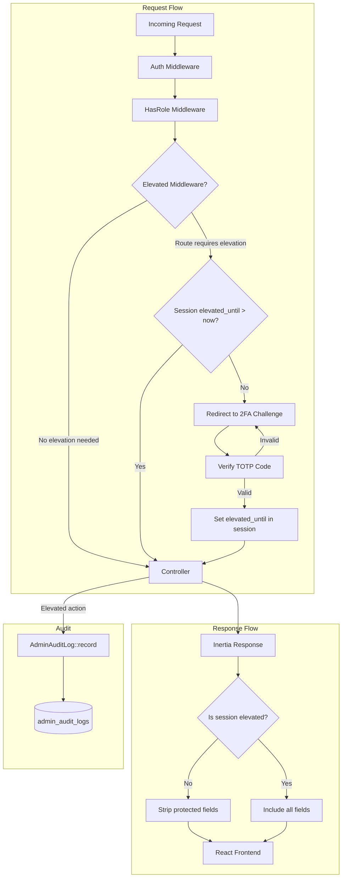
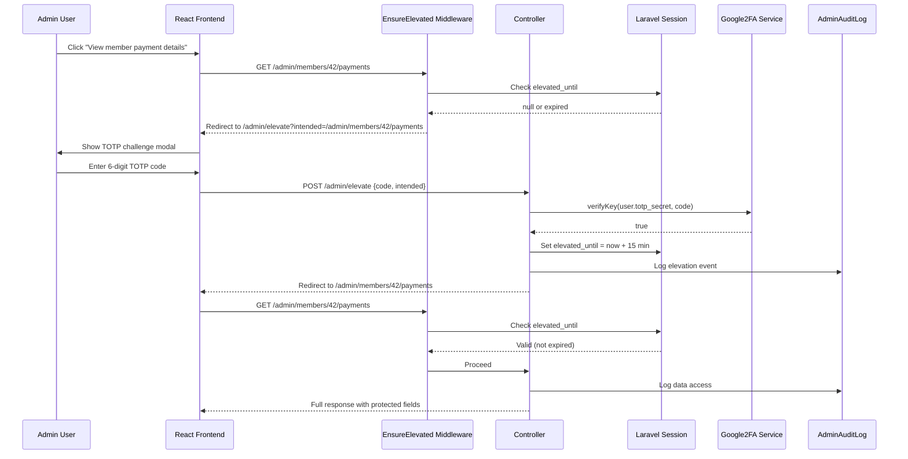
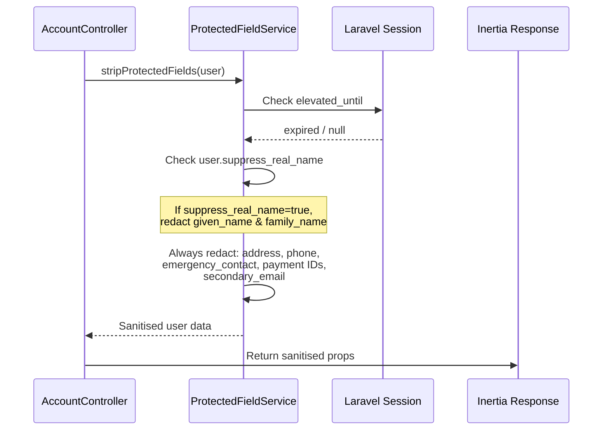

# Design Document: Elevated Admin Access

## Overview

This feature replaces the current flat role system (admin, equipment, finance, storage) with a three-tier access model: Member, Equipment Manager, and Admin. The key addition is an "elevated admin" state (sudo mode) that requires TOTP-based 2FA before accessing protected personal data or finance operations. Elevation is time-limited (15 minutes), session-scoped, and every action taken while elevated is recorded in an audit log.

The finance role is absorbed into the elevated admin flow — payment management simply requires elevation. The equipment role is renamed to Equipment Manager with clearer boundaries: full equipment CRUD but no access to personal data, payments, or member administration. The existing equipment-specific roles (trainers, maintainers, area coordinators) remain unchanged as they operate at a different granularity.

This design preserves the existing `roles` and `role_user` pivot tables, repurposing the role names. The `UserRoleTrait` and `hasRole()` checks continue to work. The main additions are: a TOTP secret on the user model, session-based elevation tracking, middleware to enforce elevation, field-level stripping in Inertia responses, and an audit log table.

## Architecture



## Sequence Diagrams

### Elevation Flow (Sudo Mode)



### Protected Field Stripping



## Components and Interfaces

### Component 1: EnsureElevated Middleware

**Purpose**: Gate-keeps routes that require elevated admin access. Checks the session for a valid `elevated_until` timestamp. If missing or expired, redirects to the TOTP challenge.

```php
interface EnsureElevatedMiddleware
{
    /**
     * @param Request $request
     * @param Closure $next
     * @return mixed — proceeds or redirects to /admin/elevate
     */
    public function handle(Request $request, Closure $next): mixed;
}
```

**Responsibilities**:
- Read `elevated_until` from session
- Compare against `now()`
- Redirect to elevation challenge with `intended` URL if expired
- Pass through if elevated and user has admin role

### Component 2: ElevationController

**Purpose**: Handles the TOTP challenge UI and verification. Sets the session elevation timestamp on success.

```php
interface ElevationController
{
    /** Show the TOTP challenge form */
    public function show(Request $request): InertiaResponse;

    /** Verify the TOTP code and elevate the session */
    public function verify(ElevationRequest $request): RedirectResponse;

    /** Manually drop elevation early */
    public function drop(Request $request): RedirectResponse;
}
```

**Responsibilities**:
- Render the TOTP challenge page (Inertia)
- Validate the 6-digit code against the user's `totp_secret` via Google2FA
- Set `session('elevated_until')` to `now()->addMinutes(15)`
- Log the elevation event to audit log
- Support voluntary de-elevation

### Component 3: TotpSetupController

**Purpose**: Handles initial TOTP setup for admin users — generating the secret, showing the QR code, and confirming the first code.

```php
interface TotpSetupController
{
    /** Show QR code and secret for setup */
    public function create(Request $request): InertiaResponse;

    /** Confirm first TOTP code and persist the secret */
    public function store(TotpSetupRequest $request): RedirectResponse;

    /** Remove TOTP (requires current elevation) */
    public function destroy(Request $request): RedirectResponse;
}
```

**Responsibilities**:
- Generate TOTP secret via Google2FA
- Produce QR code URI for authenticator apps
- Store confirmed `totp_secret` and set `totp_enabled_at` on user
- Require elevation to remove TOTP

### Component 4: ProtectedFieldService

**Purpose**: Centralised service that strips or redacts protected personal data from user records based on the current session's elevation state.

```php
interface ProtectedFieldService
{
    /**
     * Strip protected fields from a user array/resource if not elevated.
     *
     * @param array $userData  The user data (typically from toArray())
     * @param User  $subject   The user being viewed
     * @param bool  $isElevated Whether the current session is elevated
     * @return array Sanitised user data
     */
    public function sanitise(array $userData, User $subject, bool $isElevated): array;

    /**
     * Check if the current session is elevated.
     */
    public function isElevated(): bool;
}
```

**Responsibilities**:
- Define the list of always-protected fields: `address`, `phone`, `emergency_contact`, `secondary_email`, `mandate_id`, `subscription_id`, `gocardless_setup_id`
- Conditionally protect `given_name` and `family_name` when `suppress_real_name` is true
- Return redacted placeholder values (e.g. `'[protected]'`) for stripped fields
- Provide `isElevated()` helper for use in controllers and Inertia shared data

### Component 5: AdminAuditLog Model

**Purpose**: Records every action taken during an elevated admin session for accountability and compliance.

```php
interface AdminAuditLogContract
{
    /**
     * Record an audit entry for an elevated action.
     */
    public static function record(
        User $actor,
        string $action,
        ?string $targetModel = null,
        ?int $targetId = null,
        ?array $details = null
    ): self;
}
```

**Responsibilities**:
- Capture: `user_id`, `action`, `target_model`, `target_id`, `ip_address`, `details` (JSON), `created_at`
- Provide scopes for filtering by user, action type, date range
- Immutable — no update or soft-delete

## Data Models

### Model 1: User (additions)

```php
// New columns on users table
$table->string('totp_secret', 64)->nullable();
$table->timestamp('totp_enabled_at')->nullable();
```

**Validation Rules**:
- `totp_secret` is encrypted at rest (use Laravel's `encrypted` cast)
- `totp_enabled_at` is set only after first successful TOTP verification
- Admin users must have TOTP enabled to access elevated routes

### Model 2: AdminAuditLog

```php
// admin_audit_logs table
$table->id();
$table->foreignId('user_id')->constrained()->cascadeOnDelete();
$table->string('action', 100);           // e.g. 'member.view_protected', 'member.export', 'elevation.granted'
$table->string('target_model', 100)->nullable(); // e.g. 'App\Models\User'
$table->unsignedBigInteger('target_id')->nullable();
$table->ipAddress('ip_address');
$table->json('details')->nullable();      // Additional context
$table->timestamp('created_at');
```

**Validation Rules**:
- `action` is required, max 100 chars
- `ip_address` is captured from `$request->ip()`
- No `updated_at` — records are immutable
- Index on `(user_id, created_at)` for efficient querying
- Index on `(target_model, target_id)` for target lookups

### Model 3: Role Changes

The existing `roles` table stays. The role rows change:

| Current Role | New Role | Notes |
|---|---|---|
| `admin` | `admin` | Unchanged name, gains elevation capability |
| `equipment` | `equipment-manager` | Renamed, scoped to equipment CRUD only |
| `finance` | _(removed)_ | Merged into elevated admin |
| `storage` | _(removed or kept)_ | Evaluate if still needed separately |

The `role_user` pivot table is unchanged. A data migration renames `equipment` → `equipment-manager` and migrates `finance` role users to `admin` (with TOTP setup required).

## Error Handling

### Error Scenario 1: TOTP Code Invalid

**Condition**: Admin enters incorrect or expired TOTP code
**Response**: Return validation error "Invalid verification code. Please try again." Stay on the challenge page.
**Recovery**: User retries. After 5 consecutive failures within 5 minutes, lock elevation attempts for 10 minutes and log the lockout event.

### Error Scenario 2: TOTP Not Configured

**Condition**: Admin user tries to access an elevated route but has no `totp_secret` set
**Response**: Redirect to `/admin/totp/setup` with a flash message: "You need to set up two-factor authentication before accessing this area."
**Recovery**: User completes TOTP setup, then is redirected to the originally intended URL.

### Error Scenario 3: Elevation Expired Mid-Request

**Condition**: Session `elevated_until` expires between page load and form submission
**Response**: The `EnsureElevated` middleware catches this and redirects to the TOTP challenge. The `intended` URL is set to the current request URL so the user returns after re-elevating.
**Recovery**: Automatic — user re-authenticates via TOTP and the original request can be retried.

### Error Scenario 4: Non-Admin Accessing Elevated Routes

**Condition**: A user without the `admin` role somehow hits an elevated route
**Response**: Throw `AuthenticationException` (existing pattern). The `HasRole` middleware already catches this before `EnsureElevated` runs.
**Recovery**: None needed — this is a hard deny.

### Error Scenario 5: TOTP Secret Compromise

**Condition**: Admin suspects their TOTP secret has been compromised
**Response**: Admin can regenerate their TOTP secret via `/admin/totp/setup` (requires current elevation). Old secret is immediately invalidated.
**Recovery**: New QR code is generated, old sessions are de-elevated, audit log records the regeneration.

## Testing Strategy

### Unit Testing Approach

- `ProtectedFieldService`: Test that each protected field is stripped when not elevated, and present when elevated. Test `suppress_real_name` conditional logic.
- `AdminAuditLog::record()`: Test that entries are created with correct attributes.
- `EnsureElevated` middleware: Test redirect when not elevated, pass-through when elevated, redirect when expired.
- `User::isAdmin()` and role checks: Verify the renamed `equipment-manager` role works with existing `hasRole()`.

### Property-Based Testing Approach

**Property Test Library**: Pest with faker-driven data generation

- For any user data array and any elevation state, `ProtectedFieldService::sanitise()` never leaks a protected field when `isElevated` is false.
- For any valid TOTP secret and any valid time window, `Google2FA::verifyKey()` accepts codes generated within the window and rejects codes outside it.
- For any audit log entry, `created_at` is always set and `user_id` references a valid user.

### Integration Testing Approach

- Full elevation flow: Login as admin → hit elevated route → get redirected → submit TOTP → verify session has `elevated_until` → access protected data → wait for expiry → verify re-challenge.
- Field stripping in Inertia responses: Make requests to `AccountController@show` for another user, verify protected fields are absent without elevation and present with elevation.
- Audit log completeness: Perform a series of elevated actions, verify each produces an audit entry with correct action, target, and IP.
- Role migration: Verify users with old `equipment` role get `equipment-manager`, users with `finance` role get `admin`.

## Security Considerations

- **TOTP secret storage**: The `totp_secret` column uses Laravel's `encrypted` cast so it's encrypted at rest in the database. The encryption key is the app key.
- **Session fixation**: Regenerate the session ID after successful elevation to prevent session fixation attacks.
- **Elevation timeout**: 15 minutes is a reasonable default. Consider making this configurable via `config('auth.elevation_timeout')`.
- **Rate limiting**: TOTP verification endpoint should be rate-limited (5 attempts per 5 minutes per user) to prevent brute-force attacks on the 6-digit code space.
- **Audit immutability**: The `admin_audit_logs` table has no `updated_at` column and the model should disable updates and deletes. Consider a database trigger or policy to enforce this.
- **IP logging**: Capture `$request->ip()` for audit entries. Be aware of proxy headers — ensure `TrustProxies` middleware is configured correctly.
- **TOTP clock drift**: Google2FA supports a configurable window (default ±1 interval = 30 seconds). Keep the default to balance usability and security.
- **Protected field leakage**: The `ProtectedFieldService` should be the single point of field stripping. Avoid ad-hoc field removal in individual controllers to prevent inconsistencies.

## Performance Considerations

- The `EnsureElevated` middleware only reads from the session (in-memory after first load) — negligible overhead.
- `ProtectedFieldService::sanitise()` operates on arrays, not queries — no additional database calls.
- Audit log writes are fire-and-forget inserts. Consider dispatching to a queue if write volume becomes a concern, but for a membership system this is unlikely.
- Index `admin_audit_logs` on `(user_id, created_at)` and `(target_model, target_id)` for efficient admin-facing queries.

## Dependencies

- **pragmarx/google2fa-laravel** (or `pragmarx/google2fa` + `bacon/bacon-qr-code`): TOTP generation and verification. Already suggested by the user.
- **Laravel Session**: Used for `elevated_until` timestamp storage. No additional packages needed.
- **Inertia.js**: Already in use. The `HandleInertiaRequests` middleware will be extended to share elevation state with the frontend.
- **React**: Frontend components for the TOTP challenge modal, QR code display during setup, and elevation status indicator.
