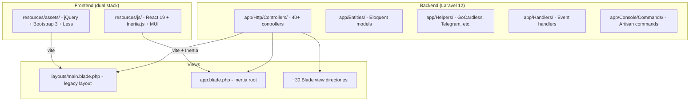
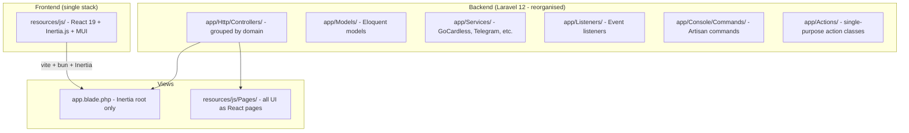
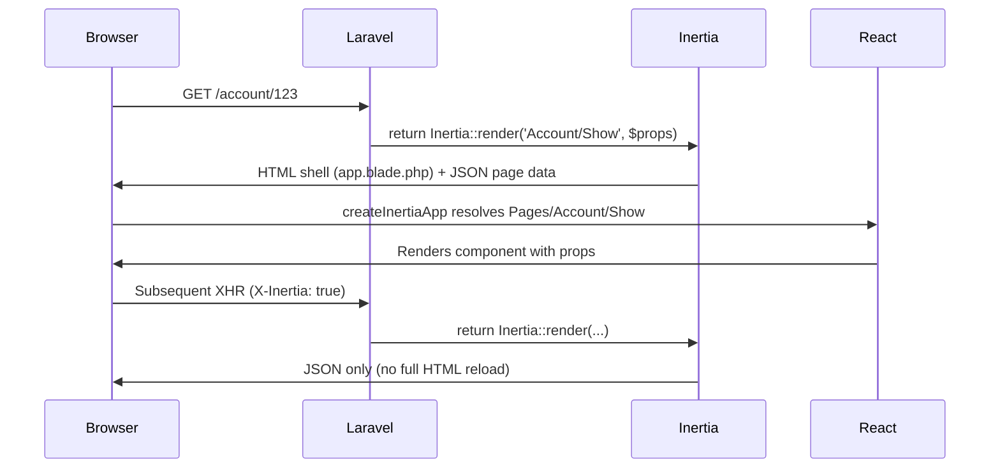
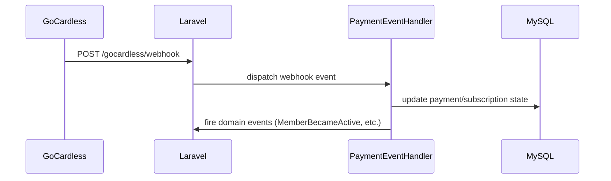

# Design Document: Membership System Restructure

## Overview

This document covers the architectural restructuring of the Hackspace Manchester membership system — a Laravel 12 / PHP 8.3 / MySQL 8.0 application. The goals are: replace yarn with bun, remove the legacy jQuery/Bootstrap 3/Less frontend stack, migrate all UI to React + Inertia.js, reorganise the `app/` directory into a cleaner Laravel-idiomatic structure, and ensure `.gitignore` properly excludes generated artefacts. The work is broken into safe, independently testable stages so the working backend is never broken.

The system currently runs two parallel frontend stacks: a legacy `resources/assets/` tree (jQuery, Bootstrap 3, Less, select2) loaded via `layouts/main.blade.php`, and a modern `resources/js/` tree (React 19, Inertia.js v2, MUI v6) loaded via `resources/views/app.blade.php`. The restructure completes the migration to the modern stack and removes the legacy one entirely.

---

## Architecture

### Current State



### Target State



---

## Sequence Diagrams

### Page Request Flow (Target)



### GoCardless Webhook Flow (unchanged)



---

## Components and Interfaces

### 1. JS Toolchain (bun + Vite)

**Purpose**: Replace yarn with bun as the package manager; keep Vite as the bundler (bun is compatible as a drop-in).

**Changes**:
- Delete `.yarnrc.yml`, `yarn.lock`
- Add `bun.lockb` (generated on first `bun install`)
- Update `package.json` `packageManager` field to `bun`
- Remove `less` devDependency (no longer needed)
- Remove `bootstrap`, `jquery`, `select2`, `material-design-icons` dependencies
- Update `vite.config.mts` to remove legacy asset inputs

**Target `vite.config.mts`**:
```typescript
import { defineConfig } from 'vite'
import laravel from 'laravel-vite-plugin'
import react from '@vitejs/plugin-react'

export default defineConfig({
    plugins: [
        laravel({
            input: ['resources/js/react-app.tsx'],
            refresh: true,
        }),
        react(),
    ],
    resolve: {
        alias: { '@': '/resources/js' },
    },
})
```

### 2. Legacy Frontend Removal

**Purpose**: Delete `resources/assets/` entirely and all Blade views that depend on `layouts/main.blade.php`.

**Scope of legacy views** (all extend `layouts.main` or use legacy partials):
- `resources/views/layouts/main.blade.php`
- `resources/views/partials/` (main-sidenav, js-data, flash-message)
- All view directories under `resources/views/` except `app.blade.php`, `emails/`, `errors/`

**Approach**: Each Blade view directory maps to a React page. Controllers are migrated to return `Inertia::render()` instead of `view()`. Views are deleted only after the corresponding React page is verified.

### 3. React/Inertia Page Migration

**Purpose**: Every route that currently returns a Blade view gets a React page counterpart.

**Page mapping** (current Blade view → target React page):

| Domain | Blade views | React Page |
|--------|-------------|------------|
| Auth | session/, password/ | Pages/Auth/Login, Pages/Auth/Password |
| Account | account/ | Pages/Account/Show, Pages/Account/Edit |
| Members | members/ | Pages/Members/Index, Pages/Members/Show |
| Equipment | equipment/, equipment_areas/ | Pages/Equipment/*, Pages/EquipmentAreas/* |
| Courses | (already exists) | Pages/Courses/* (extend existing) |
| Payments | payments/, payment_balances/, payment_overview/ | Pages/Payments/* |
| Storage | storage_boxes/ | Pages/StorageBoxes/* |
| Inductions | general-induction/ | Pages/Inductions/* |
| Admin | admin.blade.php | Pages/Admin/Index |
| Stats | stats/ | Pages/Stats/* |
| Notifications | notifications/ | Pages/Notifications/* |
| KeyFobs | keyfobs/ | Pages/KeyFobs/* |
| Roles | roles/ | Pages/Roles/* |
| Home | home.blade.php | Pages/Home/Index |

**Shared layout**: A single `resources/js/Layouts/AppLayout.tsx` wraps all pages (nav, sidebar, flash messages).

### 4. Backend App Directory Reorganisation

**Purpose**: Flatten and rename `app/` directories to standard Laravel conventions.

**Mapping**:

| Current | Target | Notes |
|---------|--------|-------|
| `app/Entities/` | `app/Models/` | Standard Laravel location |
| `app/Helpers/` | `app/Services/` | Stateless service classes |
| `app/Handlers/` | `app/Listeners/` | Standard Laravel event listener name |
| `app/Data/` | `app/Data/` | Keep (DTO/value objects) |
| `app/FlashNotification/` | `app/Services/FlashNotification/` | Move under Services |
| `app/Http/Controllers/` | `app/Http/Controllers/` | Keep, optionally group by domain |
| `app/Events/` | `app/Events/` | Keep as-is |
| `app/Exceptions/` | `app/Exceptions/` | Keep as-is |
| `app/Console/` | `app/Console/` | Keep as-is |

**Namespace change**: `BB\Entities\*` → `BB\Models\*` (update all references via IDE refactor or sed).

**Composer autoload** remains `"BB\\": "app/"` — no change needed.

### 5. Gitignore Hardening

**Purpose**: Ensure `node_modules/`, `vendor/`, `public/build/`, and bun artefacts are excluded.

**Target additions to `.gitignore`**:
```
/node_modules
bun.lockb
/.bun
```

Note: `bun.lockb` is a binary lockfile — teams should commit it (like `yarn.lock`) but it's listed here for awareness. The decision to commit or ignore it should be explicit.

---

## Data Models

No database schema changes are required. All Eloquent models move from `app/Entities/` to `app/Models/` with namespace update only.

### Key Models (namespace change only)

```typescript
// Illustrative — PHP classes, shown as types for clarity
User          // BB\Models\User (was BB\Entities\User)
Payment       // BB\Models\Payment
Induction     // BB\Models\Induction
Equipment     // BB\Models\Equipment
Course        // BB\Models\Course
SubscriptionCharge // BB\Models\SubscriptionCharge
KeyFob        // BB\Models\KeyFob
StorageBox    // BB\Models\StorageBox
```

### Inertia Prop Shapes (new — typed on frontend)

```typescript
// resources/js/types/index.ts
export interface User {
  id: number
  name: string
  email: string
  status: 'active' | 'inactive' | 'suspended' | 'left'
  subscription_amount: number
  profile_photo: string | null
}

export interface Payment {
  id: number
  amount: number
  type: string
  status: string
  created_at: string
}

export interface Equipment {
  id: number
  name: string
  slug: string
  description: string
  area: EquipmentArea
  requires_induction: boolean
}
```

---

## Algorithmic Pseudocode

### Migration Algorithm: Controller → Inertia

```pascal
ALGORITHM migrateController(controller)
INPUT: controller — a Laravel controller returning view()
OUTPUT: controller updated to return Inertia::render()

BEGIN
  FOR each method IN controller.methods DO
    IF method returns view(template, data) THEN
      targetPage ← mapBladeToReactPage(template)
      
      IF reactPageExists(targetPage) THEN
        replace view(template, data) WITH Inertia::render(targetPage, data)
        deleteBladeTemplate(template)
      ELSE
        createReactPage(targetPage, data)
        replace view(template, data) WITH Inertia::render(targetPage, data)
        deleteBladeTemplate(template)
      END IF
    END IF
  END FOR
END
```

### Migration Algorithm: Entities → Models

```pascal
ALGORITHM renameEntities()
INPUT: app/Entities/ directory
OUTPUT: app/Models/ with updated namespaces

BEGIN
  FOR each file IN app/Entities/ DO
    newPath ← replace("Entities", "Models", file.path)
    newNamespace ← replace("BB\Entities", "BB\Models", file.namespace)
    
    move(file, newPath)
    updateNamespace(file, newNamespace)
  END FOR
  
  // Update all references across codebase
  FOR each phpFile IN app/, tests/, routes/, config/ DO
    replaceAll("BB\Entities\\", "BB\Models\\", phpFile)
    replaceAll("use BB\Entities\", "use BB\Models\", phpFile)
  END FOR
  
  composer dump-autoload
  runTests()  // must pass before proceeding
END
```

### Dependency Removal Algorithm

```pascal
ALGORITHM removeLegacyDeps()
INPUT: package.json with legacy deps
OUTPUT: clean package.json, no legacy files

BEGIN
  // Step 1: Remove from package.json
  remove dependencies: [bootstrap, jquery, select2, material-design-icons]
  remove devDependencies: [less]
  
  // Step 2: Remove legacy source files
  delete resources/assets/
  
  // Step 3: Update vite config
  remove from vite inputs: [resources/assets/js/app.js, resources/assets/less/application.less]
  
  // Step 4: Reinstall
  bun install
  bun run build
  
  // Step 5: Verify
  ASSERT no references to resources/assets/ remain in Blade views
  ASSERT vite build succeeds
END
```

---

## Key Functions with Formal Specifications

### mapBladeToReactPage(template)

```pascal
FUNCTION mapBladeToReactPage(template: string): string
```

**Preconditions:**
- `template` is a valid Blade template path (e.g. `members.index`)
- Template exists in `resources/views/`

**Postconditions:**
- Returns a React page path (e.g. `Members/Index`)
- Returned path follows PascalCase convention
- Mapping is deterministic (same input → same output)

### Inertia::render() contract

```pascal
FUNCTION render(component: string, props: array): Response
```

**Preconditions:**
- `component` matches a file in `resources/js/Pages/`
- `props` contains only JSON-serialisable values
- User is authenticated where route requires `role:member`

**Postconditions:**
- On first load: returns full HTML via `app.blade.php`
- On Inertia XHR: returns JSON `{component, props, url, version}`
- Props are available as typed React component props

---

## Error Handling

### Scenario 1: React page missing during migration

**Condition**: Controller returns `Inertia::render('Foo/Bar', ...)` but `Pages/Foo/Bar.tsx` doesn't exist.
**Response**: Inertia throws a 404 / component resolution error in the browser console.
**Recovery**: Create the missing page before switching the controller. Migration order: create page → update controller → delete Blade view.

### Scenario 2: Namespace reference missed after Entities → Models rename

**Condition**: A PHP file still references `BB\Entities\User` after the rename.
**Response**: PHP fatal error / class not found.
**Recovery**: Run `grep -r "BB\\\\Entities" app/ tests/ routes/` to find stragglers. PHPUnit test suite catches this before deployment.

### Scenario 3: bun incompatibility with a package

**Condition**: A package in `package.json` has a lifecycle script or binary that doesn't work with bun.
**Response**: `bun install` or `bun run build` fails.
**Recovery**: Check bun compatibility notes. Most Vite/React packages work fine. Fallback: use `bun run --bun vite` or pin the problematic package.

### Scenario 4: Legacy Blade view still referenced after deletion

**Condition**: A controller still calls `view('members.index')` after the file is deleted.
**Response**: Laravel throws `InvalidArgumentException: View [members.index] not found`.
**Recovery**: Grep for `view(` calls in controllers and ensure all are migrated before deleting views.

---

## Testing Strategy

### Unit Testing Approach

- All existing PHPUnit tests must pass at every stage of the migration.
- Run `php artisan test` after each phase before committing.
- New service classes (moved from Helpers) should have unit tests covering their public methods.
- Namespace renames are verified by the test suite passing (class-not-found errors surface immediately).

### Property-Based Testing Approach

Not applicable to this restructure (no algorithmic logic changes, only structural/organisational changes).

### Integration Testing Approach

- Use Laravel's `BrowserKitTesting` (already in `require-dev`) to verify key routes return 200 after each controller migration.
- Key routes to smoke-test after each phase:
  - `GET /` (home)
  - `GET /login`
  - `GET /account/{id}` (authenticated)
  - `POST /gocardless/webhook` (webhook still works)
  - `GET /courses` (already on Inertia)

### Frontend Testing

- Existing Jest + `@testing-library/react` setup is preserved.
- New React pages should have at minimum a render smoke test.
- Run `bun test` (replaces `yarn test`) after toolchain switch.

---

## Performance Considerations

- Switching from yarn to bun reduces `install` time from ~30s to ~3s on a cold cache.
- Removing Bootstrap 3, jQuery, select2, Less from the bundle eliminates ~200KB of legacy JS/CSS from the build output.
- Bun uses esbuild under the hood for transpilation (via Vite), so build times improve.
- Target file count reduction: ~180k files → ~30k files (node_modules shrinks significantly with bun's binary linking).
- Inertia's partial reloads mean subsequent navigations only fetch changed props, not full HTML.

---

## Security Considerations

- No authentication or authorisation logic changes. Existing `role:*` middleware is preserved.
- GoCardless webhook endpoint (`POST /gocardless/webhook`) is exempt from CSRF in `VerifyCsrfToken` — this must be preserved during any middleware refactor.
- Inertia automatically includes the CSRF token in XHR requests via the `X-XSRF-TOKEN` header — no manual token handling needed in React.
- Sentry browser DSN config in `app.blade.php` is preserved.

---

## Dependencies

### Removed (JS)
- `bootstrap` ^3.3.4
- `jquery` ^3.5.1
- `select2` ^3.5.2
- `material-design-icons` ^2.0.0
- `less` (devDependency)

### Added (JS toolchain)
- `bun` (replaces yarn — installed globally or via mise)

### Kept (JS)
- `react` ^19, `react-dom` ^19
- `@inertiajs/react` ^2
- `@mui/material` ^6, `@mui/icons-material` ^6, `@emotion/react`, `@emotion/styled`
- `@fontsource/roboto`
- `vite` ^5, `laravel-vite-plugin` ^1, `@vitejs/plugin-react` ^4
- `typescript` ^5, all ESLint/Prettier tooling
- `jest`, `@testing-library/react` (test suite)

### PHP (no changes)
- All existing `composer.json` dependencies are preserved.
- `inertiajs/inertia-laravel` ^1.0 stays.


---

## Correctness Properties

*A property is a characteristic or behavior that should hold true across all valid executions of a system — essentially, a formal statement about what the system should do. Properties serve as the bridge between human-readable specifications and machine-verifiable correctness guarantees.*

### Property 1: No legacy layout extension remains

*For any* `.blade.php` file present in `resources/views/` after the migration, the file must not contain an `@extends('layouts.main')` directive.

**Validates: Requirement 3.4**

### Property 2: Every Inertia render call has a matching page component

*For any* `Inertia::render('ComponentName', ...)` call found in the codebase, there must exist a corresponding file at `resources/js/Pages/ComponentName.tsx` (or `.jsx`).

**Validates: Requirement 4.2**

### Property 3: No legacy namespace references remain

*For any* PHP file under `app/`, `tests/`, `routes/`, or `config/`, the file must contain no string matching `BB\Entities`, `BB\Helpers`, or `BB\Handlers`.

**Validates: Requirement 5.5**
